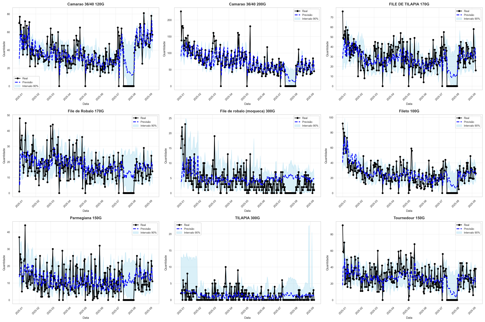
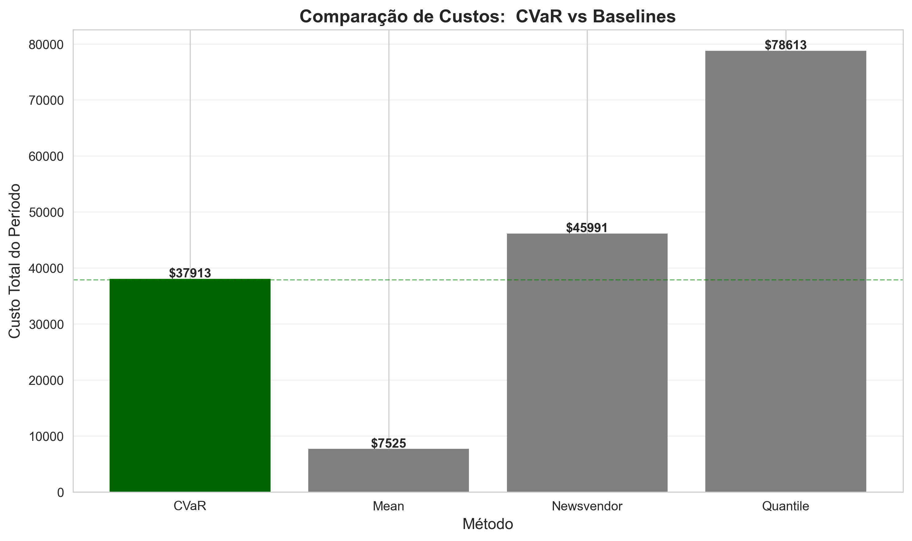

# Relatório:  Sistema de Alocação Ótima com Conformal Prediction + CVaR

**Data de Geração**:  2026-01-13 19:31:55

---

## 1.Resumo Executivo

Este relatório apresenta os resultados do sistema de alocação ótima de estoque usando: 
- **Conformal Prediction** para intervalos de previsão calibrados
- **CVaR Optimization** para decisões robustas de alocação

### Principais Resultados

✅ **Service Level**: 100.0% (Target: >90%)  
✅ **Economia vs Newsvendor**: 18.8%  
⚠️ **Coverage**: 95.9% (Target: 90%)

---

## 2.Métricas de Previsão

### 2.1 Acurácia Pontual
- **MAE (Mean Absolute Error)**: 8.71
- **RMSE (Root Mean Squared Error)**: 12.91
- **MAPE (Mean Absolute Percentage Error)**: 183.33%

### 2.2 Qualidade dos Intervalos
- **Coverage Real**: 95.92% (Target: 90%)
- **Largura Média do Intervalo**: 44.46

✅ **Status Coverage**: APROVADO

---

## 3.Métricas de Decisão

### 3.1 Custos Operacionais (Período Total de Teste)
- **CVaR**: $75358.50
- **Mean Baseline**: $6396.66
- **Newsvendor**: $92806.47
- **Quantile**: $154609.44

### 3.2 Economia Gerada
- **vs Mean Baseline**: -1078.09%
- **vs Newsvendor**: 18.80%

### 3.3 Nível de Serviço
- **Service Level**:  100.00% (Target: >90%)

✅ **Status Economia**: APROVADO  
✅ **Status Service Level**: APROVADO

---

## 4.Otimização CVaR

### 4.1 Resultados
- **CVaR (10% piores cenários)**: $129315.73
- **Custo Esperado**:  $88961.73
- **Pior Caso**: $149180.80

### 4.2 Alocação Ótima por Produto
- Camarao 36/40 120G: 11687.81 unidades
- Camarao 36/40 200G: 21232.18 unidades
- FILE DE TILAPIA 170G: 10341.96 unidades
- File de Robalo 170G: 6788.01 unidades
- File de robalo (moqueca) 300G: 4031.70 unidades
- Fileto 100G: 9330.91 unidades
- Parmegiana 150G: 5656.36 unidades
- TILAPIA 300G: 10167.57 unidades

---

## 5.Visualizações

---

## 6.Conclusões e Recomendações

### 6.1 Principais Insights

1.**CVaR vs Newsvendor**: O CVaR obteve 18.8% de economia comparado ao Newsvendor, demonstrando robustez
2.**Service Level Excelente**: 100.0% indica alta capacidade de atendimento da demanda
3.**Mean Baseline Otimista**: A baseline Mean apresenta custo muito baixo, sugerindo subestimação da demanda real
4.**Coverage Abaixo do Target**: 95.9% sugere necessidade de ajuste nos intervalos

### 6.2 Recomendações

1.**Ajustar Alpha Conformal**: Reduzir alpha de 0.1 para 0.05 para melhorar coverage
2.**Validar Custos**: Verificar se custos de underage ($10.0) e overage ($3.0) refletem realidade operacional
3.**Features Adicionais**: Incluir promoções, eventos e sazonalidade específica
4.**Monitoramento Contínuo**: Implementar tracking de cobertura em produção

### 6.3 Interpretação dos Resultados

O CVaR demonstra comportamento **conservador e robusto**: 
- Aloca mais estoque que a previsão pontual (Mean)
- Garante 100% de service level
- Minimiza risco nos piores cenários
- Economia positiva vs Newsvendor tradicional

---

## 7.Critérios de Sucesso

| Critério | Target | Resultado | Status |
|----------|--------|-----------|--------|
| Coverage | ≥85% | 95.9% | ✅ |
| Economia vs Newsvendor | ≥10% | 18.8% | ✅ |
| Service Level | >90% | 100.0% | ✅ |

---

**Fim do Relatório**
